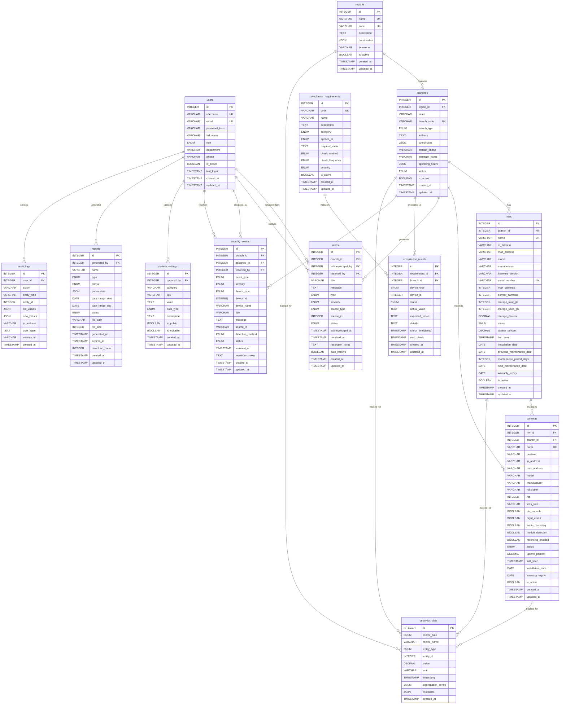

```mermaid
erDiagram
    %% Core User Management
    users {
        INTEGER id PK
        VARCHAR username UK
        VARCHAR email UK
        VARCHAR password_hash
        VARCHAR full_name
        ENUM role
        VARCHAR department
        VARCHAR phone
        BOOLEAN is_active
        TIMESTAMP last_login
        TIMESTAMP created_at
        TIMESTAMP updated_at
    }
    
    %% Geographic Organization
    regions {
        INTEGER id PK
        VARCHAR name UK
        VARCHAR code UK
        TEXT description
        JSON coordinates
        VARCHAR timezone
        BOOLEAN is_active
        TIMESTAMP created_at
        TIMESTAMP updated_at
    }
    
    branches {
        INTEGER id PK
        INTEGER region_id FK
        VARCHAR name
        VARCHAR branch_code UK
        ENUM branch_type
        TEXT address
        JSON coordinates
        VARCHAR contact_phone
        VARCHAR manager_name
        JSON operating_hours
        ENUM status
        BOOLEAN is_active
        TIMESTAMP created_at
        TIMESTAMP updated_at
    }
    
    %% Device Management
    nvrs {
        INTEGER id PK
        INTEGER branch_id FK
        VARCHAR name UK
        VARCHAR ip_address
        VARCHAR mac_address
        VARCHAR model
        VARCHAR manufacturer
        VARCHAR firmware_version
        VARCHAR serial_number UK
        INTEGER max_cameras
        INTEGER current_cameras
        INTEGER storage_total_gb
        INTEGER storage_used_gb
        DECIMAL storage_percent
        ENUM status
        DECIMAL uptime_percent
        TIMESTAMP last_seen
        DATE installation_date
        DATE previous_maintenance_date
        INTEGER mantenance_period_days
        DATE next_maintenance_date
        DATE warranty_expiry
        BOOLEAN is_active
        TIMESTAMP created_at
        TIMESTAMP updated_at
    }
    
    cameras {
        INTEGER id PK
        INTEGER nvr_id FK
        INTEGER branch_id FK
        VARCHAR name UK
        VARCHAR position
        VARCHAR ip_address
        VARCHAR mac_address
        VARCHAR model
        VARCHAR manufacturer
        VARCHAR resolution
        INTEGER fps
        VARCHAR lens_size
        BOOLEAN ptz_capable
        BOOLEAN night_vision
        BOOLEAN audio_recording
        BOOLEAN motion_detection
        BOOLEAN recording_enabled
        ENUM status
        DECIMAL uptime_percent
        TIMESTAMP last_seen
        DATE installation_date
        DATE warranty_expiry
        BOOLEAN is_active
        TIMESTAMP created_at
        TIMESTAMP updated_at
    }
    
    %% Alert Management
    alerts {
        INTEGER id PK
        INTEGER branch_id FK
        INTEGER acknowledged_by FK
        INTEGER resolved_by FK
        VARCHAR title
        TEXT message
        ENUM type
        ENUM severity
        ENUM source_type
        INTEGER source_id
        ENUM status
        TIMESTAMP acknowledged_at
        TIMESTAMP resolved_at
        TEXT resolution_notes
        BOOLEAN auto_resolve
        TIMESTAMP created_at
        TIMESTAMP updated_at
    }
    
    %% Compliance Management
    compliance_requirements {
        INTEGER id PK
        VARCHAR code UK
        VARCHAR name
        TEXT description
        ENUM category
        ENUM applies_to
        TEXT required_value
        ENUM check_method
        ENUM check_frequency
        ENUM severity
        BOOLEAN is_active
        TIMESTAMP created_at
        TIMESTAMP updated_at
    }
    
    compliance_results {
        INTEGER id PK
        INTEGER requirement_id FK
        INTEGER branch_id FK
        ENUM device_type
        INTEGER device_id
        ENUM status
        TEXT actual_value
        TEXT expected_value
        TEXT details
        TIMESTAMP check_timestamp
        TIMESTAMP next_check
        TIMESTAMP created_at
        TIMESTAMP updated_at
    }
    
    %% Security Monitoring
    security_events {
        INTEGER id PK
        INTEGER branch_id FK
        INTEGER assigned_to FK
        INTEGER resolved_by FK
        ENUM event_type
        ENUM severity
        ENUM device_type
        INTEGER device_id
        VARCHAR device_name
        VARCHAR title
        TEXT message
        VARCHAR source_ip
        ENUM detection_method
        ENUM status
        TIMESTAMP resolved_at
        TEXT resolution_notes
        TIMESTAMP created_at
        TIMESTAMP updated_at
    }
    
    %% Analytics and Reporting
    analytics_data {
        INTEGER id PK
        ENUM metric_type
        VARCHAR metric_name
        ENUM entity_type
        INTEGER entity_id
        DECIMAL value
        VARCHAR unit
        TIMESTAMP timestamp
        ENUM aggregation_period
        JSON metadata
        TIMESTAMP created_at
    }
    
    reports {
        INTEGER id PK
        INTEGER generated_by FK
        VARCHAR name
        ENUM type
        ENUM format
        JSON parameters
        DATE date_range_start
        DATE date_range_end
        ENUM status
        VARCHAR file_path
        INTEGER file_size
        TIMESTAMP generated_at
        TIMESTAMP expires_at
        INTEGER download_count
        TIMESTAMP created_at
        TIMESTAMP updated_at
    }
    
    %% System Configuration
    system_settings {
        INTEGER id PK
        INTEGER updated_by FK
        VARCHAR category
        VARCHAR key
        TEXT value
        ENUM data_type
        TEXT description
        BOOLEAN is_public
        BOOLEAN is_editable
        TIMESTAMP created_at
        TIMESTAMP updated_at
    }
    
    audit_logs {
        INTEGER id PK
        INTEGER user_id FK
        VARCHAR action
        VARCHAR entity_type
        INTEGER entity_id
        JSON old_values
        JSON new_values
        VARCHAR ip_address
        TEXT user_agent
        VARCHAR session_id
        TIMESTAMP created_at
    }
    
    %% Relationships
    
    %% Geographic Hierarchy
    regions ||--o{ branches : "contains"
    
    %% Device Hierarchy
    branches ||--o{ nvrs : "has"
    branches ||--o{ cameras : "monitors"
    nvrs ||--o{ cameras : "manages"
    
    %% Alert Relationships
    branches ||--o{ alerts : "generates"
    users ||--o{ alerts : "acknowledges"
    users ||--o{ alerts : "resolves"
    
    %% Compliance Relationships
    compliance_requirements ||--o{ compliance_results : "validates"
    branches ||--o{ compliance_results : "evaluated_at"
    
    %% Security Relationships
    branches ||--o{ security_events : "occurs_at"
    users ||--o{ security_events : "assigned_to"
    users ||--o{ security_events : "resolves"
    
    %% Analytics Relationships
    regions ||--o{ analytics_data : "tracked_for"
    branches ||--o{ analytics_data : "tracked_for"
    nvrs ||--o{ analytics_data : "tracked_for"
    cameras ||--o{ analytics_data : "tracked_for"
    
    %% User Activity Relationships
    users ||--o{ system_settings : "updates"
    users ||--o{ reports : "generates"
    users ||--o{ audit_logs : "creates"
```